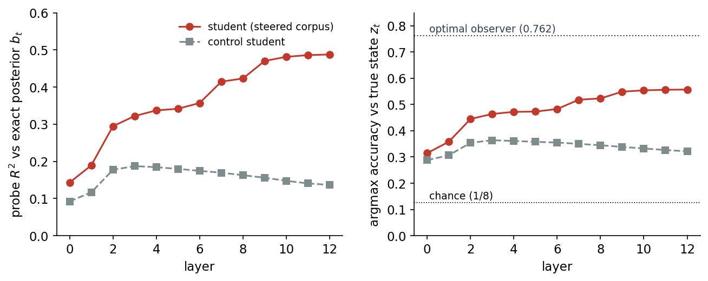
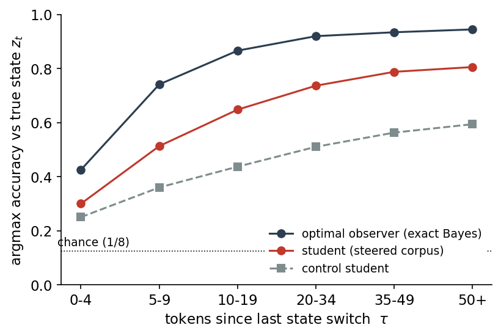
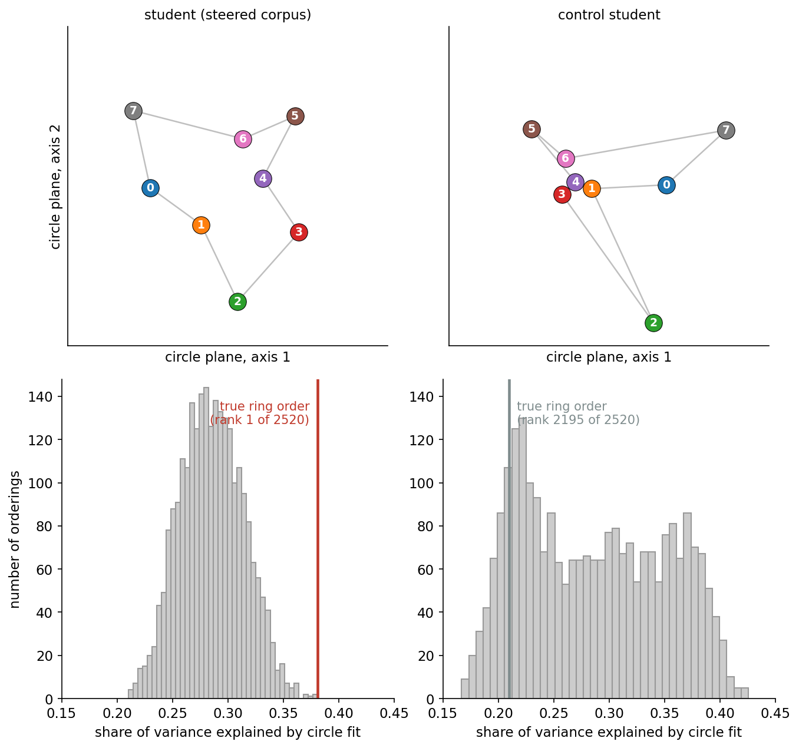

# manifold_polytopes

Experiments on hidden-state geometry in transformers — why concepts form manifolds (rings, curves,
simplices), and whether a concept's geometry is inherited from the **statistical dynamics of the
latent variable behind it**.

**Headline result (exp06, written up as *"Planting a Latent Variable in Natural-Looking Text: a
More Realistic Test of Belief States and Their Link to Concept Geometry"*, LessWrong draft):**
we plant a controllable latent variable inside natural-looking text. An LLM teacher writes
ordinary text while we "subliminally" steer it along one of K = 8 unrelated sparse-autoencoder
directions at each token, the active direction following a ring-shaped Markov chain. A small
transformer trained from scratch on this corpus (1) tracks the Bayesian posterior over the planted
variable, and (2) arranges the 8 states themselves on a ring, in the exact order of the Markov
chain. Since the 8 directions are unrelated in the teacher, that geometry can only come from the
dynamics we imposed.

## The method (exp06)

We cannot write down natural language's latent variables as HMMs — so instead we use steering to
**add one of our own**. The teacher is Gemma-2-2B (base) with a pretrained Gemma Scope SAE at
layer 12. We select 8 near-orthogonal, causal, non-co-activating latents; at every token, the
current state z_t picks one decoder direction, which is added (norm-compensated) to the residual
stream at layers 12–23 while the teacher writes. z_t walks a ring: p_stay = 0.95, else hop to a
ring neighbor (mean dwell ≈ 20 tokens). Each document's state path is sampled before generation.

Two design points that make the analysis exact:

- **Clean cache.** The KV cache is rebuilt at every token, so steering never touches the visible
  context — each token depends only on (text so far, current state). The corpus is then a true
  token-labeled HMM in Shai et al.'s formalism, and the **optimal observer** (exact Bayes over
  the teacher's per-state token probabilities) is computable at every token. Its posterior b_t is
  the probe target.
- **Corpus scale.** 400k documents × 256 tokens (~102M tokens), s = 1.5 steering strength chosen
  by a fluency-gated sweep. A control corpus (steering off) trains an identical control student.

The **student** is a 110M-parameter Llama-style transformer (12 layers, width 768) trained from
scratch on the corpus tokens and nothing else.

## Results

**The student tracks the belief state.** A ridge probe from the residual stream to the optimal
observer's posterior reaches R² = 0.488 (argmax accuracy 0.557 vs the ideal reader's 0.762 —
~¾ of ceiling), while the control student's beliefs stall at R² = 0.137:

Accuracy climbs with tokens since the last state switch (0.30 → 0.81) — real evidence
integration, lagging the exact-Bayes reader but with the same shape:

The probe's read-out reproduces the observer's belief simplex — noisier, but with the confident
beliefs at the corners in the exact ring order:

**The 8 states sit on a ring.** Per-state activation centroids at layers 9–11 sit in exact
neighbor order (distance–ring-distance corr 0.45; control 0.11). A carryover control (centroids
from each document's first dwell only, so no ring-neighbor predecessor in context) kills the
2-PC circle — but a direct circle fit in ring order still explains 38% of centroid variance at
layer 11, and the true ring order ranks **1st of all 2520 orderings** (control lands
mid-distribution). The ring is real and exactly ordered, just sub-dominant — the planted variable
only injects ~0.05–0.1 nats/token of evidence, so most of the residual stream is spent on
ordinary language features:

The same structure shows in raw similarities: centroid cosine is warmest on the neighbor
diagonals (resembling the transition matrix T), while whitened probe directions are most
*anti*-correlated exactly there — the probe spends its capacity separating the pairs the
representation mixes most:

## Experiment log

| # | Folder | Status | One-liner |
|---|---|---|---|
| 01 | `experiments/01_latent_features/` | done — hypothesis confirmed | Toy transformer; 3 latent features with chosen coupling kernels M (identity / circular band / linear band). Each feature's layer-2 geometry matches its M (Gram–M corr > 0.99, 3 seeds): simplex, ring, and open curve in one network. v2: co-occurrence dissociation — M wins all symmetric venues. |
| 03 | `experiments/03_steered_corpus/` | superseded by 04 | First steered-corpus attempt (clamped steering, stale KV cache). Students track beliefs, but steering leaked into the cached context, so the corpus wasn't a true HMM and no exact reader exists. |
| 04 | `experiments/04_clean_cache/` | done — evidence too weak | Clean-cache re-run: exact ideal reader now computable, but clamp steering leaves min pairwise margin 0.081 nats/token vs per-token noise ~0.41 — the reader itself can barely track. |
| 05 | `experiments/05_multilayer_add/` | done — tracking, no ring | Multi-layer additive steering fixes the evidence rate (margin ~0.28, clean fluency). Student tracks beliefs (concat R² 0.21 vs ctrl 0.11) but never learns the ring; the apparent mid-dwell ring was a context-carryover artifact. At p_stay = 0.98, knowing the transition map is worth ~nothing in next-token loss. |
| 06 | `experiments/06_short_dwell/` | **done — headline result** | Shorter dwell (p_stay 0.95) + s = 1.5 makes the map worth learning (~3× wiring incentive). Student tracks beliefs at ¾ of the exact-Bayes ceiling and arranges the 8 states on a ring in exact Markov order (rank 1/2520), surviving the first-dwell carryover control. |

(There is no exp02 folder — a planned in-the-wild color-geometry study that hasn't been started.)

## Background: the coupling-kernel (M-dial) hypothesis

The polytopes of Park et al. (categorical concepts as simplices) and the concept manifolds of the
interpretability literature (circular features, color manifolds) may be **the same object at
different settings of one dial: the attribute coupling matrix M** — M_ij = how much evidence for
attribute i moves attribute j's log-odds.

- Park's *causal separability* (M = identity) forces a regular simplex.
- Coupled attributes (evidence for *red* is partial evidence for *orange*) push the vertices off
  the simplex; a smooth banded M yields a low-dimensional curve — a manifold. Dimensionality of
  the polytope ≈ rank of row-centered M.
- In computational-mechanics language: polytopes and manifolds are both **belief geometries** —
  reachable sets of Bayesian posteriors over a latent, linearly embedded in the residual stream.
  With static latents, M (the log-emission overlap kernel) alone fixes the reachable set; with
  dynamics, the transition operator shapes it too. Exp01 confirmed the static (M-dial) corner;
  exp06 shows the dynamic (T-dial) side in natural-looking text.

Open empirical claims about *real* LLMs, untouched by any toy result: **(A)** real LLMs violate
causal separability for graded categories (color), with the overlap pattern tracking the
perceptual metric (CIELAB), not noise; **(B)** the kernel shaping the polytope is
evidence-coupling from latent world structure, not raw textual co-occurrence (Karkada et al.) —
dissociating cells: *black/white* and *red/green* co-occur heavily but are perceptually opposite.

## Position relative to computational mechanics

A full read of the Simplex/Astera papers (Aug 2026) set the boundary of what is ours to defend:

- **Shai et al. 2024** ([2405.15943](https://arxiv.org/abs/2405.15943)): transformers trained on
  HMM output linearly represent belief-state geometry. Parent framework — but purely synthetic
  token streams. Exp06's contribution is the same test with a planted latent inside
  natural-looking text, plus the link from belief dynamics to the geometry of the state
  representations themselves (flagged open in their §4.3).
- **Shai et al. 2026** ([2602.02385](https://arxiv.org/abs/2602.02385)): independent latent
  factors → orthogonal subspaces (Factored World Hypothesis). Exp01's near-orthogonal feature
  subspaces are a replication of this, not a novel finding.
- **Piotrowski et al. 2025** ([2502.01954](https://arxiv.org/abs/2502.01954)): mechanism —
  attention implements parallelized approximate Bayes, predicted spectrally from T. Answers
  mechanism-level questions about our setups.

None of the three vary a factor's kernel to move geometry along the polytope↔manifold axis,
connect belief geometry to the LLM feature-geometry literature, or plant a controlled latent in
natural language. Those are this repo's lanes.

## Key papers

| Paper | Ref | Role here |
|---|---|---|
| Park, Chen, Veitch — *The Geometry of Categorical and Hierarchical Concepts in LLMs* | [2406.01506](https://arxiv.org/abs/2406.01506) | Starting framework: attribute vectors, causal inner product, categorical concepts as simplices via causal separability. We relax separability. |
| Shai, Marzen, Teixeira, Oldenziel, Riechers — *Transformers Represent Belief State Geometry in their Residual Stream* | [2405.15943](https://arxiv.org/abs/2405.15943) | Parent framework (NeurIPS 2024): activations linearly represent the mixed-state presentation of the generating process. Names the belief-states↔features bridge as open (§4.3). |
| Shai, Amdahl-Culleton et al. — *Transformers Learn Factored Representations* | [2602.02385](https://arxiv.org/abs/2602.02385) | Factored World Hypothesis: independent latent factors → orthogonal subspaces, via combination-token worlds. Subsumes exp01's factorization result. |
| Piotrowski, Riechers, Filan, Shai — *Constrained Belief Updates Explain Geometric Structures in Transformer Representations* | [2502.01954](https://arxiv.org/abs/2502.01954) | Mechanism (ICML 2025): attention implements parallelized approximate Bayes; attention/OV/embeddings predicted spectrally from T. |
| Sarfati, Lubana et al. — *The Shape of Beliefs* (Goodfire) | [2602.02315](https://arxiv.org/abs/2602.02315) | Posterior manifolds in pretrained Llama over in-context number-distribution parameters. Numerical settings only; a single case study of in-context inference — names natural language as open. |
| Morgulis, Hewitt — *Subliminal Steering* | [2604.25783](https://arxiv.org/abs/2604.25783) | Steered teacher → generated data → student inherits bias and steering direction. Feasibility evidence for our steering channel. |
| Fel, Kowal et al. — *Block-Sparse Featurizers Capture Visual Concept Manifolds* (BSF) | [2606.25234](https://arxiv.org/abs/2606.25234) | Concepts as low-dim manifolds (vision models). The phenomenon we want to explain. |
| Karkada, Korchinski, Nava, Wyart, Bahri — *Symmetry in language statistics shapes the geometry of model representations* | [2602.15029](https://arxiv.org/abs/2602.15029) | The rival theory: geometry from co-occurrence symmetry (months → circles). Claim B dissociates from it; their robustness anomaly is our opening. |
| Engels et al. — *Not All Language Model Features Are One-Dimensionally Linear* | [2405.14860](https://arxiv.org/abs/2405.14860) | Circular multi-dim features (days/months) in LLMs; the LRH weakened to manifolds. Methodological template. |
| Abdou et al. — *Can Language Models Encode Perceptual Structure Without Grounding?* | [ACL CoNLL 2021](https://aclanthology.org/2021.conll-1.9/) | Canonical color study: contextual embeddings align with CIELAB, peaking mid-layer. |
| Wurgaft, Rager et al. — *Manifold Steering Reveals the Shared Geometry of Representation and Behavior* | [2605.05115](https://arxiv.org/abs/2605.05115) | On- vs off-manifold steering; representation↔behavior correspondence. |
| Ma, Beck, Latham, Pouget — *Bayesian inference with probabilistic population codes* | Nat. Neuro 2006 | Neuroscience lineage: M = tuning-curve overlap; smooth overlap → ring attractors. |
| Arora et al. — *A Latent Variable Model Approach to Word Embeddings* (RAND-WALK) | TACL 2016 | Embedding geometry inherited from a log-linear generative model. Genre ancestor. |
| Elhage et al. — *Toy Models of Superposition* | 2022 | Precedent for controlled-data toy geometry studies. |
| Nanda et al. — grokking modular arithmetic | 2023 | Circles emerge in small transformers on synthetic tasks. |

## Design lessons

Why the experiments are synthetic/controlled, in one breath each:

1. **Readout tautology** — at the final layer any context shift couples similar words' logits
   through the unembedding Gram matrix, so observational coupling measurements come for free.
2. **Context leakage** — natural evidence prompts carry topical baggage, which is exactly the
   rival (co-occurrence) theory's signal.
3. **Steering circularity** — steering along attribute i injects its overlap with neighbors by
   hand; naive steering reads back the injection.
4. **Escape** — make the latent structure the data-generating law (choose M, or plant z via
   subliminal steering); geometry becomes the dependent variable with known ground truth.
5. **Don't presuppose the geometry** — parameterize by M / T, not by a circular latent θ.
6. **Keep the latent latent** — combination tokens (exp01) or steering directions the student
   never sees named (exp03–06); finding the geometry in hidden states is then a discovery.
7. **Beware carryover** — the previous state lingers in the context and is always a ring
   neighbor; every geometry claim needs a first-dwell (carryover-free) control (exp05's lesson).

## Conventions

- One folder per experiment under `experiments/`, numbered, self-contained: own `README.md`
  (spec + findings), `src/`, `results/`.
- Shared code gets extracted to a top-level `shared/` only when a second experiment actually
  needs it.
- Python via conda; each experiment pins its env when code lands.
